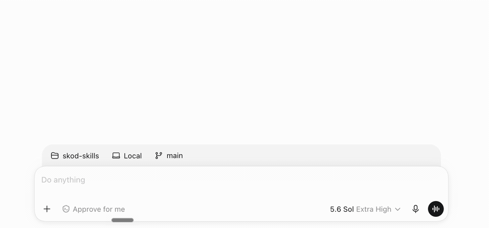
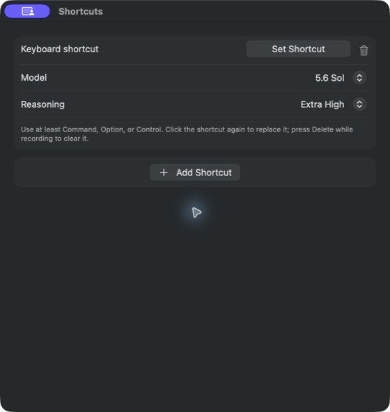

# ReasonDeck

ReasonDeck is a small macOS menu-bar app for switching model and reasoning settings in supported AI apps with keyboard shortcuts you choose.

It is local-only and unofficial. It is not affiliated with or endorsed by OpenAI, Anthropic, Cursor, or Google.





## Download

### [Download ReasonDeck 0.2.1 for Mac](https://github.com/thierryskoda/ReasonDeck/releases/download/v0.2.1/ReasonDeck-0.2.1.dmg)

Universal app for Apple silicon and Intel · macOS 14 or later · [release notes and checksum](https://github.com/thierryskoda/ReasonDeck/releases/tag/v0.2.1)

Version 0.2.1 includes model-and-effort shortcuts for ChatGPT, Claude Desktop Home/Chat, Cursor, and Antigravity. It also includes Cursor's **Next finished session** shortcut.

### Install

1. Open the DMG and drag **ReasonDeck** to **Applications**.
2. Open ReasonDeck from Applications. It appears in the menu bar instead of the Dock.
3. In Settings, choose **Allow Accessibility** and **Allow Input Monitoring**, then enable ReasonDeck in the System Settings panes that open.
4. Review the two starter shortcuts or customize their models, efforts, and keys.

Official binaries are signed with Developer ID and notarized by Apple. Do not install a copy that requires a Gatekeeper bypass or a terminal command.

## What it does

- Creates any number of model-and-effort shortcuts.
- Keeps every model shortcut editor visible for direct configuration.
- Runs a shortcut only when its supported app is frontmost.
- Passes the same keys through normally in every other app.
- Rejects shortcuts without Command, Option, or Control and prevents duplicates.
- Reports unavailable choices instead of guessing or silently substituting another model.

On a first installation, the current source creates two editable starter shortcuts:

| Shortcut | ChatGPT | Claude Desktop | Cursor | Antigravity |
| --- | --- | --- | --- | --- |
| `⌘⇧1` economical | 5.6 Luna / High | Sonnet 5 / Medium | Composer 2.5 Fast / High | Gemini 3.7 Flash / High |
| `⌘⇧2` premium | 5.6 Sol / High | Sonnet 5 / High | GPT-5.6 Sol / High | Gemini 3.1 Pro / High |

Existing saved configurations are left unchanged. An explicit **Reset to Empty** also stays empty.

Claude's Home/Chat composer passed signed live switching on Claude Desktop 1.34493.1 with a Free account; it works independently of the paid Code tab. New shortcuts use the Home-compatible Sonnet 5 Medium/High pairs, while existing saved shortcuts remain unchanged. Haiku 4.5 selects successfully, but Claude exposes its `Extended` mode instead of ReasonDeck's standard effort set, so a requested standard effort is truthfully reported as unavailable. The separate Code-tab path still requires a paid account and remains experimental until it passes a signed live switch.

ChatGPT models currently recognized by source: 5.6 Sol, 5.6 Terra, 5.6 Luna, 5.5, 5.4, 5.4 Mini, and 5.3 Codex Spark.

ChatGPT efforts currently recognized by source: Extra High, Medium, None, Light, Ultra, High, and Max.

## Requirements and compatibility

- macOS 14 or later
- The English ChatGPT Mac app (`com.openai.codex`)
- The English Claude Desktop app (`com.anthropic.claudefordesktop`); a paid plan is required only for the separate Code tab
- The English Cursor Mac app (`com.todesktop.230313mzl4w4u92`)
- The English Antigravity Mac app (`com.google.antigravity`)
- Accessibility and Input Monitoring permission

ChatGPT support expects a normal conversation with the composer visible and the native **Select model** command (`⌃⇧M`) available. Preview, sidebar, and task layouts are not supported targets.

Cursor support expects an idle Agent or Chat composer with its model chip visible. The 0.2.0 baseline covers Cursor 3.15.6 and 3.16.29 on macOS 26.5.1. Cursor's server-driven model list can change, so ReasonDeck accepts only exact labels it knows and fails closed on anything else.

Compilation and unit tests are not compatibility proof. Each supported app version needs a signed live check before it is claimed for a release.

## Privacy and safety

- No network implementation, analytics, or account credentials.
- No collection, storage, logging, or transmission of chat or editor content.
- Shortcuts capture the frontmost supported process, then verify its focused window before switching.
- ChatGPT, Claude Desktop, Cursor, and Antigravity recheck that target before actions and verify the final selection.
- Model and effort labels are closed sets in source.
- No fixed screen coordinates.

ReasonDeck stores only shortcut, model, and reasoning preferences in macOS `UserDefaults`. Accessibility is used to find and verify the active app's controls; Input Monitoring is used for the shortcuts you configure.

The switching design is documented in [ADR-001](ADR-001-accessibility-automation.md), [ADR-002](ADR-002-claude-code-desktop.md), [ADR-003](ADR-003-cursor-model-picker.md), and [ADR-004](ADR-004-cursor-unread-navigation.md).

## Troubleshooting

- **Permissions are required:** Use the matching **Allow** action in ReasonDeck Settings, enable the installed app in System Settings, then return to ReasonDeck.
- **Hotkeys do not respond:** Confirm ReasonDeck appears and is enabled in **System Settings > Privacy & Security > Input Monitoring**. Use **Allow Input Monitoring…** in ReasonDeck if the list has no ReasonDeck entry, then choose **Quit & Reopen** when macOS asks.
- **Only the model changes:** The requested effort was unavailable or could not be verified. ReasonDeck reports a partial result instead of rolling the model back.
- **Claude Desktop's controls cannot be found:** On Home, select Chat and leave the composer visible. For Claude Code, open an idle Code session on a paid plan.
- **A shortcut will not save:** Include Command, Option, or Control. Escape cancels recording, unmodified Delete clears it, and duplicate combinations are rejected.
- **Cursor's model control is unavailable:** Open the Agents sidebar and leave an idle Agent or Chat composer visible.
- **A model is unavailable:** The account or app no longer exposes the exact saved label. ReasonDeck does not substitute a similar model.
- **Saved shortcuts are invalid:** Open Settings and choose **Reset to Empty**. Invalid persisted configuration stays disabled until you explicitly reset it.

## Build from source

Building requires Xcode with the macOS SDK.

```sh
git clone https://github.com/thierryskoda/ReasonDeck.git
cd ReasonDeck
cp Config/Local.xcconfig.example Config/Local.xcconfig
```

Set `DEVELOPMENT_TEAM` in `Config/Local.xcconfig`, then run:

```sh
swift test
xcodebuild \
  -project ReasonDeck.xcodeproj \
  -scheme ReasonDeck \
  -configuration Release \
  -derivedDataPath build \
  build
open build/Build/Products/Release/ReasonDeck.app
```

Keep the tracked bundle identifier unless you intentionally want a separate development identity and separate macOS privacy grants. Use a consistently signed Release build for live permission testing; the SwiftPM debug executable is not a supported live app identity.

CI runs the tests and an unsigned universal Release build. It has no Apple credentials and cannot publish the app.

## Contributing

Small, focused improvements are welcome. Please open an issue before a large behavior or architecture change.

Run `swift test` before submitting code. Changes to Accessibility targeting, click or key delivery, phase ordering, permissions, signing, or supported model labels also need a signed Release build and a live check in an idle, normal-layout target session. The ADRs above explain the fail-closed constraints that contributions must preserve.

Maintainers can find the release checklist in [docs/RELEASING.md](docs/RELEASING.md).

## Uninstall

Quit ReasonDeck and move it from Applications to the Trash. Saved shortcuts remain available for a later reinstall. To remove them too:

```sh
defaults delete com.thierryai.ReasonDeck
```

## License

[MIT](LICENSE) © 2026 Thierry Skoda
